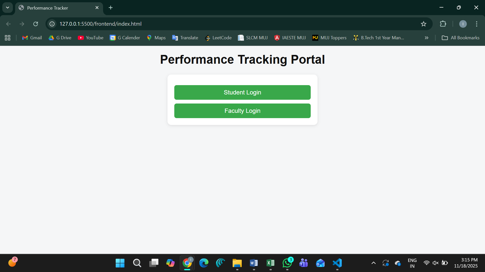
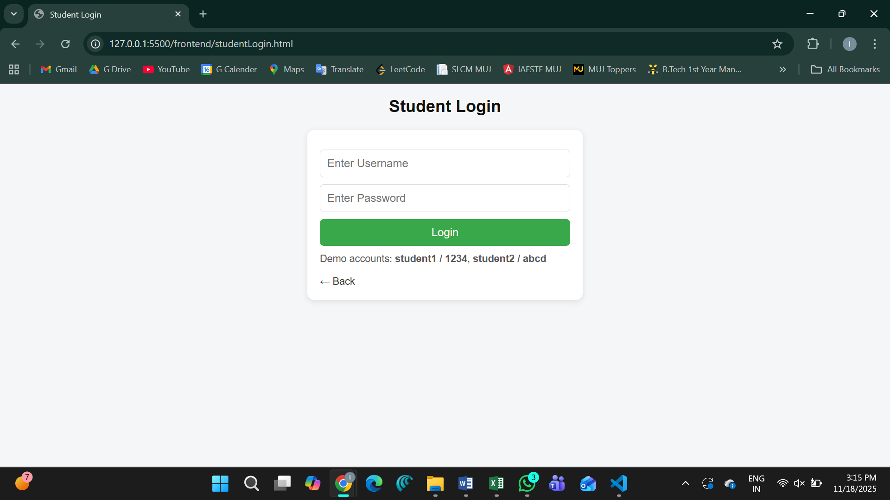
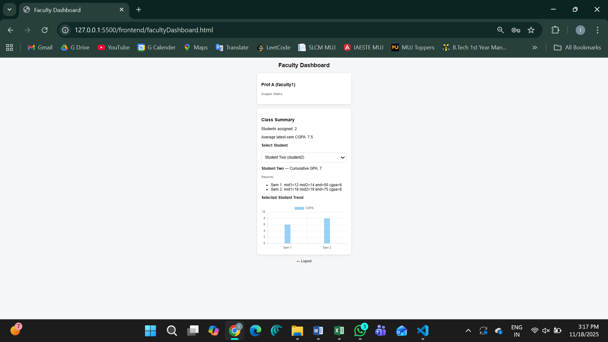

# INTRODUCTION

Monitoring student performance is a critical component of effective teaching and learning, yet both professors and students often lack accessible tools to track academic progress. Professors face difficulties in evaluating the performance trends of multiple students, while students are unable to clearly assess whether they are progressing in the right direction. This gap leads to delayed interventions, limited self-awareness, and reduced academic improvement.

To overcome these challenges, this project proposes a web-based Student Performance Analysis and Prediction System. The platform enables students to securely log in, review their marks, analyze performance trends, and understand their predicted academic trajectory using statistical models. Professors are provided with an intuitive dashboard that allows them to view, compare, and analyze the performance of all students under their supervision. Through data visualization, predictive analytics, and an organized performance record system, the platform facilitates informed decision-making and fosters continuous academic improvement. The system ultimately aims to enhance transparency, support personalized mentoring, and contribute to a more data-driven learning environment.

# LITERATURE SURVEY

## 1\. Introduction

Educational institutions increasingly rely on data-driven systems to monitor academic progress and support timely interventions. The field of **Educational Data Mining (EDM)** and **Learning Analytics (LA)** studies how student data—such as exam scores, assignments, attendance, and LMS activity—can be used to understand learning patterns and predict academic outcomes. Accurate grade prediction allows teachers to identify at-risk students, while self-prediction tools help students understand their performance trajectory. This survey examines existing research on grade prediction models, dashboard systems, and performance-tracking tools, highlighting their strengths, limitations, and relevance to the proposed project.

## 2\. Existing Research on Student Performance Prediction

### a) Linear and Statistical Models

Linear Regression is one of the most widely used techniques for predicting student performance based on continuous variables. Studies by Ahmad et al. (2015) and Musso et al. (2020) show that linear models provide strong baseline accuracy and clear interpretability—helpful for teachers who want to understand why a prediction was made.  
However, linear models assume a straight-line relationship and struggle with non-linear patterns in educational datasets.

### b) Logistic Regression for Classification

When predicting categorical outcomes such as “pass/fail” or “at-risk/not at-risk,” logistic regression is commonly used. Research by Amrieh et al. (2016) shows that logistic regression can effectively classify student risk levels using minimal features such as quizzes and assignments.  
But logistic models do not provide fine-grained score predictions (e.g., exact marks or CGPA).

### c) Decision Trees & Ensemble Learning

Decision Trees, Random Forests, and Gradient Boosting models are frequently applied in EDM because they handle mixed data types and non-linear relationships.  
Studies like **Saa (2016)** and **Peña-Ayala (2014)** report that **Random Forest and Gradient Boosting consistently outperform linear models** in prediction accuracy.  
Their drawback is reduced interpretability—though feature importance metrics mitigate this problem.

### d) Support Vector Machines & Neural Networks

SVMs and Neural Networks (ANNs) are effective for complex classification and regression tasks.  
Research by **Kotsiantis et al. (2004)** and **Dutt et al. (2017)** indicates strong predictive accuracy with ANN models.  
However, NN models require large datasets and are not easily explainable to faculty or students.

### e) Time-Series and Sequential Approaches

Some advanced studies use time-series models (LSTM networks, ARIMA) to model performance changes across semesters.  
While powerful, these require continuous historical data—often unavailable in college environments—making them less suitable for simple semester-based forecasting.

## 3\. Dashboards and Visualization Tools

Modern research emphasizes the importance of actionable dashboards.

*   **Schwendimann et al. (2017)** show that dashboards significantly improve teacher decision-making.
*   **Ifenthaler & Yau (2020)** report that visual tools improve student self-regulation and academic planning.

Despite these advancements, few tools allow **scenario-based forecasting** (e.g., “What if the student scores 70 in MTE and 60 in ETE?”).  
This gap is addressed by the proposed project.

## 4\. Comparative Analysis of Methods

| Method | Used For | Advantages | Limitations | References |
| --- | --- | --- | --- | --- |
| Linear Regression | Score prediction | Simple, interpretable | Assumes linearity | Ahmad (2015), Musso (2020) |
| Logistic Regression | Pass/Fail | Good for risk classification | No score prediction | Amrieh (2016) |
| Decision Trees | General prediction | Easy to visualize | Overfitting | Peña-Ayala (2014) |
| Random Forest | High-accuracy prediction | Captures non-linearities | Less interpretable | Saa (2016) |
| Gradient Boosting | Complex patterns | High accuracy | Requires tuning | Dutt (2017) |
| SVM | Classification | Accurate for small datasets | Hard to interpret | Kotsiantis (2004) |
| Artificial Neural Networks | Regression & classification | Learns complex features | Needs large data | Dutt (2017) |
| Time-Series Models | Sequential prediction | Models long-term progress | Requires continuous data | Musso (2020) |

## 5\. Key Gaps Identified in Literature

Based on the above studies, the following gaps remain unaddressed:

1.  Lack of simple, interpretable prediction tools for both students and faculty.
2.  Few systems support scenario-based forecasting (predicting outcomes for various MTE/ETE combinations).
3.  Most solutions require large datasets, which are not always available.
4.  Dashboards are often teacher-centric, with limited student self-analysis support.

## 6\. Relevance to the Proposed Project

The proposed system addresses these gaps by:

*   Using a **simple and interpretable prediction model** (linear regression or weighted scoring).
*   Providing **scenario-based forecasting** through a grid of possible MTE–ETE score combinations.
*   Building a **dual dashboard system**:
    *   **Students** → can check progress and expected CGPA
    *   **Faculty** → can monitor students and test hypothetical score scenarios
*   Being deployable even with **small datasets**, suitable for college environments.

This makes the system practical, scalable, and aligned with the latest research trends.

# COMPARITIVE STUDY

| S.No. | Author / Year | Method / Technique Used | Dataset Used | Advantages | Limitations |
| --- | --- | --- | --- | --- | --- |
| 1 | Ahmad et al. (2015) | Linear Regression | Exam scores from university students | Simple, interpretable, good baseline accuracy | Assumes linearity; weak for complex datasets |
| 2 | Amrieh et al. (2016) | Logistic Regression | Secondary school exam dataset | Good for pass/fail or at-risk classification | Cannot predict exact marks or CGPA |
| 3 | Peña-Ayala (2014) | Decision Trees | Mixed academic datasets | Easy to visualize, handles non-linear patterns | Overfits easily; less stable |
| 4 | Saa (2016) | Random Forest | Undergraduate academic performance data | High accuracy; handles missing data | Harder to interpret; needs tuning |
| 5 | Dutt et al. (2017) | Gradient Boosting Models | Multi-semester university dataset | Best predictive performance; strong for small datasets | Computationally heavy, requires parameter tuning |
| 6 | Kotsiantis et al. (2004) | Support Vector Machines | Distance learning dataset | Strong accuracy for small/medium datasets | Difficult to explain to faculty/students |
| 7 | Romero & Ventura (2020) | Artificial Neural Networks | Learning management system (LMS) Logs | Learns complex patterns; high accuracy | Requires large datasets; “black-box” model |
| 8 | Musso et al. (2020) | Mixed Statistical + ML Models | 1st-year engineering dataset | Combines interpretability + strong performance | Not ideal for real-time prediction dashboards |
| 9 | Schwendimann et al. (2017) | Learning Analytics Dashboards | LMS activity data | Improves instructor decision-making; good visualization | No predictive capabilities; only monitoring |
| 10 | Ifenthaler & Yau (2020) | Student Self-Regulation Dashboards | Higher education analytics data | Helps students plan and reflect | No score prediction; does not support forecasting |

# PROBLEM STATEMENT

Professors often struggle to efficiently monitor the academic progress of multiple students, as traditional methods such as manual record keeping, spreadsheets, or isolated departmental systems are time-consuming, prone to errors, and lack real-time insights. Students, on the other hand, have limited ways to evaluate their own performance trends, identify weak areas, or estimate their potential CGPA based on current mid-semester and end-semester scores. The absence of a unified, interactive platform that enables both faculty and students to track performance, visualize progress, and receive data-driven predictions leads to poor academic planning, delayed interventions, and reduced learning outcomes. Therefore, there is a need for an accessible, predictive, and analytics-based system that allows students to monitor their academic standing and enables faculty to oversee and support the progress of their entire class effectively.

# OBJECTIVE

1.  To develop a unified digital platform that enables students to record, track, and analyze their academic performance across mid-semester and end-semester assessments.
2.  To provide predictive analytics using linear regression for estimating current-semester and overall CGPA, helping students understand their academic trajectory.
3.  To enable faculty members to efficiently monitor, compare, and evaluate the progress of all students under their supervision through a centralized dashboard.
4.  To improve academic decision-making by offering real-time insights, performance trends, and early identification of weak areas for both students and faculty.
5.  To reduce the manual workload involved in maintaining academic records and enhance transparency between students and faculty regarding academic progress.

# PROPOSED SOLUTION

The proposed solution is to develop an integrated, web-based Student Performance Monitoring and Prediction System designed to improve transparency, accuracy, and accessibility of academic progress for both students and faculty. The platform consists of two role-specific dashboards—one for students and one for professors—supported by a secure backend infrastructure and a well-structured database that ensures reliable data storage and retrieval.

Students will begin by registering with a unique ID, after which they gain access to a personalized dashboard. Here, they can enter internal marks, assignments, mid-semester results, and attendance records. This data is stored in the backend (Node.js, Express, MongoDB), enabling real-time performance visualization using dynamic charts such as line graphs, bar charts, pie charts, and radar charts. Students also receive predictive insights where the system applies machine learning methods—primarily Linear Regression, Polynomial Regression, and Moving Average Trend Analysis—to estimate their expected end-semester results, SGPA, or CGPA. These predictions help students understand whether they are on track and identify where they need improvement. The platform also supports chart exportation in formats like PNG, PDF, and CSV for academic documentation.

Faculty members access a separate dashboard with advanced analytics tools. They can view complete performance records of all students under their supervision, analyze subject-wise trends, compare individual or group progress, and detect at-risk learners using classification techniques such as Logistic Regression. The dashboard provides consolidated visual summaries, including class averages and grade distributions, enabling data-driven academic decisions. Faculty can also export reports for departmental use, ensuring better monitoring and timely intervention.

Overall, the system integrates secure authentication, intuitive UI, predictive analytics, and multi-format visualization to create a smart academic support ecosystem. It reduces manual workload for faculty, enhances student self-awareness, and brings a structured, data-driven approach to tracking academic performance in real time.

# SCREENSHOTS

### 1. System Architecture

### 2. Student Login Page

### 3. Student Dashboard

### 4. Faculty Login Page

### 5. Faculty Dashboard

# BIBLIOGRPAHY/REFERENCES

1.  Ahmad, F., Ismail, N. H., & Aziz, A. A. (2015). Student performance prediction based on linear regression. Journal of Theoretical and Applied Information Technology, 78(3).
2.  Amrieh, E. A., Hamtini, T., & Aljarah, I. (2016). Mining educational data to predict student performance using machine learning techniques. International Journal of Advanced Computer Science and Applications, 7(6).
3.  Peña-Ayala, A. (2014). Educational data mining: A survey and a data mining-based analysis of recent works. Expert Systems with Applications, 41(4), 1432–1462. [https://doi.org/10.1016/j.eswa.2013.08.042](https://doi.org/10.1016/j.eswa.2013.08.042)
4.  Saa, A. A. (2016). Educational data mining & students’ performance prediction. International Journal of Advanced Computer Science and Applications, 7(5).
5.  Dutt, A., Ismail, M. A., & Herawan, T. (2017). A systematic review on educational data mining. IEEE Access, 5, 15991–16005. [https://doi.org/10.1109/ACCESS.2017.2654247](https://doi.org/10.1109/ACCESS.2017.2654247)
6.  Musso, M. F., Kyndt, E., Cascallar, E., & Dochy, F. (2020). Data mining to predict academic performance. Frontiers in Psychology, 11, 476. [https://doi.org/10.3389/fpsyg.2020.00476](https://doi.org/10.3389/fpsyg.2020.00476)
7.  Kotsiantis, S., Pierrakeas, C., & Pintelas, P. (2004). Predicting students’ performance using machine learning techniques. Applied Artificial Intelligence, 18(5), 411–426. [https://doi.org/10.1080/08839510490442058](https://doi.org/10.1080/08839510490442058)
8.  Schwendimann, B. et al. (2017). Perceptions of learning analytics dashboards. Journal of Learning Analytics, 4(3), 24–20.
9.  Ifenthaler, D., & Yau, J. Y. (2020). Utilising learning analytics for study success. Educational Technology & Society, 23(4), 1–4.
10. Romero, C., & Ventura, S. (2020). Educational data mining and learning analytics: An updated survey. Wiley Interdisciplinary Reviews: Data Mining and Knowledge Discovery, 10(3). [https://doi.org/10.1002/widm.1355](https://doi.org/10.1002/widm.1355)
